# Endless-Nodes

Some basic custom nodes for the ComfyUI user interface for Stable Diffusion. Features:

+ **True batch multiprompting capability for ComfyUI**
+ An image saver for images and JSON files to base folder, custom folders for one, or custom folders for both. Also allows for Python timestamping
+ Switches for text and numbers
+ Random prompt selectors
+ Parameter randomizers
+ Image Analysis nodes for novelty and complexity
+ More to come (maybe)

When using the [ComfyUI](https://github.com/comfyanonymous/ComfyUI) interface for AI art generation, I sometimes find that the standard nodes and the many custom nodes out there don't work the way I want them to, or how I think they should.

Rightly or wrongly, I was teaching myself a bit of Python back in 2023 to get some nodes up and running to do what I'd like, and I am starting to do that again. Yes, I am using ChatGPT, Copilot, Claude and others, and yes, I am a glutton for punishment. There are no promises that these nodes will work for you or that I will maintain them. Feel free to do with them as you wish, according to the license model.

***
**UPDATE: JUN 28, 2025**

**Updated Batch Flux node to handle separate Clip and T5 text encoders along with separate Flux weight files.  Updated the SDXL node to handle separate Clip-L and CLip-G encoders**
+ Corrected Prompt Counter Node so it can accept either pipe (**\|**) or newline characters as line breaks, allowing it to be connected immediately to the Batch Prompt node (unlike before), or somewhere else downstream from the prompt creation node(s).
+ Uploaded JSON files for SD1*x* and SD2*x*, SDXL, and updated Flux batch workflow with standardized loader nodes appropriate to the model. Aso uploade dynamci workflow JSON.
+ Added an example dynamic prompt workflow for Flux that can be repurposed for other models.  Added images with embedded workflows for the above.

***
**UPDATE: JUN 23, 2025**

**Added Endless Pandemonium node, repurposed Endless Chaos node, cleaned up some typos, did some bug squishing.**
+ There was little difference between the Mayhem and Chaos nodes, with the exception of flipping the image orientation.  So, that function was moved into the Mayhem node and the Chaos node now randomly changes the aspect ratio on you.
+ Introducing the Endless Pandemonium node, a black box that randomly and invisibly changes parameters on you
+ Added the ability to use 64 or 16 as the minimum steps for the dimensions in the Randomizer nodes
+ The Randomizer nodes now have CFG Guidance outputs for Flux

**UPDATE: JUN 21, 2025**

Blew everything up and removed all the old nodes.  Nodes with new coding have been uploaded and will be updated semi-frequently until mid-July 2025
***
## Installation Instructions

It’s preferable to install from the ComfyUI Node Manager, but for direct installation, do this:

+ Navigate to your /ComfyUI/custom_nodes/ folder 
+ In Windows, you can then right-click to start a command prompt and type:

`git clone https://github.com/tusharbhutt/Endless-Nodes`

If installed correctly, you should see a menu choice in the main ComfyUI menu that look like this: 

Endless 🌊✨

with several submenus for you to select from.
***
## Assistance Requests

I am not a programmer, nor do I care to be.  I have a fulltime job that eats up 50-60 hours a week and I made these nodes for myself.   I’ve tested the nodes on my system and uploaded them as they seem to work. They may or may not work for you or on your system.  

If you have issues, ask me **nicely** for help. Your tone matters; I'm too old and tired to pay attention to people who think I blew up their machines, and if how I react to you if you are difficult bothers you, some self-reflection is in order on your part.  You are not "forthright" or "honest" or "direct", you're merely an ass if you think badgering people is justifiable to get what you want.  The world has too many assholes, don't make me think you're another one.
***
## Node List

### Batch Multiprompt Node for SD, SDXL, and FLUX

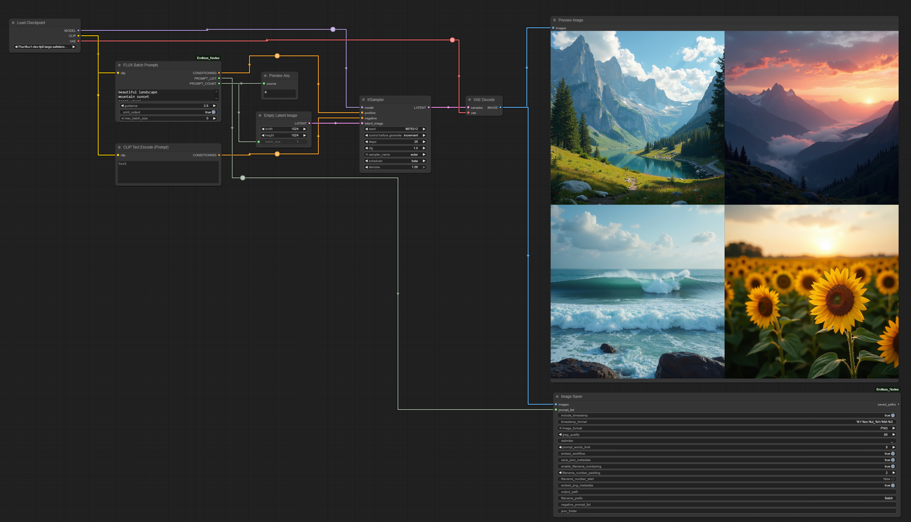

See the video!


As far as I know, ComfyUI does not have native capability to allow for different prompts to be run within the *same* batch.  With ComfyUI native, you can set the batch size to, say, create 12 images of the same prompt or you can change the queue to have 30 runs of different prompts, one prompt at a time. I always found both methods to be "wasteful" if you have  powerful card with a lot of VRAM.  I don't, by the way :)

Also, there are some nodes that will create multiple prompts in batches, but the ones I looked at showed they were just doing what is essentially queue management and prompts were still being done one at a time.  This set of nodes will allow you to create as many prompts as your VRAM can hold and does them *simultaneously*.  Nodes are available for SDx, SDXL, and Flux. 

You can try this out too: pair a wildcard node in the front end with the batch sampler, set your queue to "Run (instant)" and enjoy endless random batched prompts

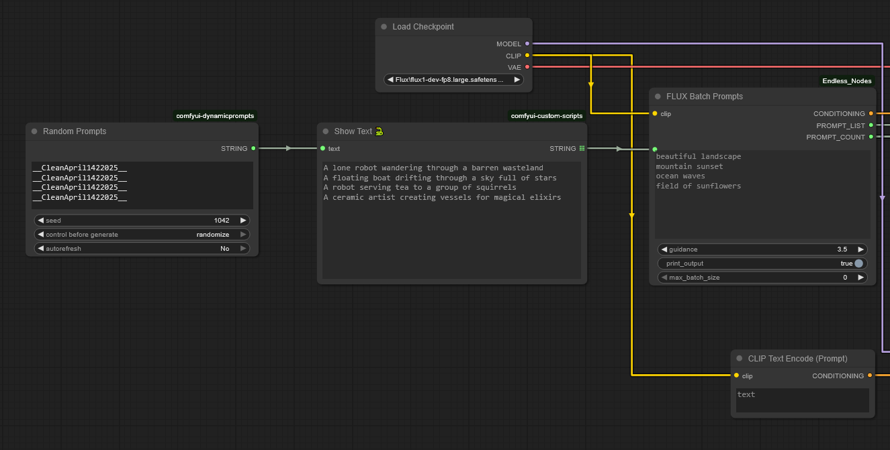

**Nodes available:**
+ SD node for SD1.x and 2.x
+ SDXL node
+ Negative prompt node … yep, make your negative prompts go through simultaneously too
+ Flux node with built-in guidance scale
+ Prompt Counter node that can show you the prompts that were run

Inputs:
+ CLIP 
+ Prompts: enter up to 64 prompts at once, the node figures out how many you have.  You can enter prompts directly or via a multiline input node.
+ Print output to console 
+ Maximum batch size (leave at zero to match your line input)

Output:
+ Conditioning: works with standard KSampler
+ Prompt List: For downstream node usage
+ Prompt Count: Counts how many prompts you had

The images below should have workflows built in but if not, check out the workflows folder too.  The image of the beaver is set up for the SD1.*x*/SD2.*x* node (called the "Simple Batch Prompts" node), the goose superhero is for SDXL, the moose overlord is for Flux, and the pink sock monkey is an example of using the Flux batcher with Dynamic Prompts.  That (sadly,abandoned) custom node is available [here if you need it](https://github.com/adieyal/comfyui-dynamicprompts)

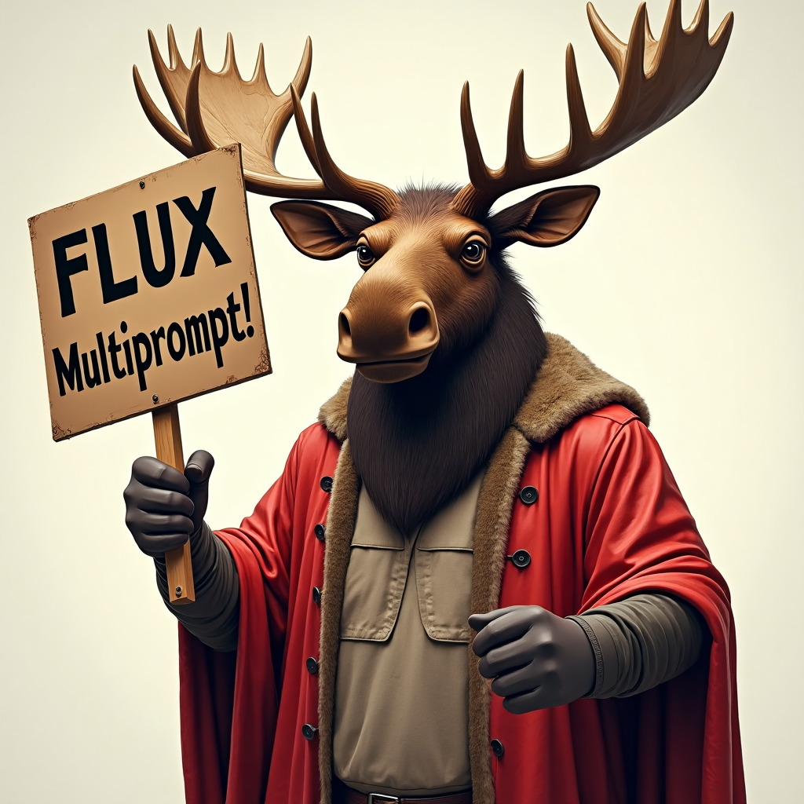
Image with embedded Flux workflow


Image with embedded SDXL workflow

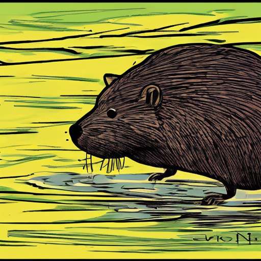<br>
Image with embedded  SD1.*x*/SD2.*x* workflow


Image with embedded [Dynamic Prompts](https://github.com/adieyal/comfyui-dynamicprompts) and Flux workflow

## Endless Image Saver

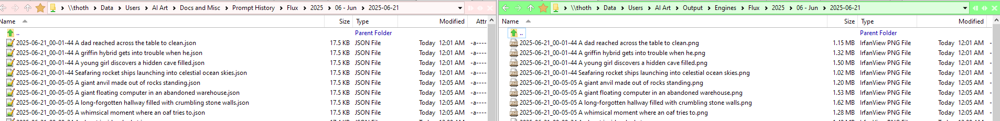

This is why I tried my hand at Python in the first place! There are many good image saver nodes out there, so why one more? Well:

+ The default saver at the time did not save to UNC in Windows, even if you tried to put it in the extra paths YAML file
+ Some savers will allow you to save to UNC but have restricted built-in folder formats
+ You can cobble some savers and text nodes together to save an image together with a text file, but the timestamp on the text file tends to be 2-3 seconds off from the image
+ No saver I know of lets you save the JSON file to a **completely different folder**

So: this node will allow you to save your image file wherever you want, with full support for standard [Python date and time conventions](https://strftime.org/) and you can save the JSON file somewhere else.  The feature list includes:

+ Allows multiprompts to be saved as part of the file name via the `prompt_list` input
+ Add timestamps in varying formats
+ Saves images in three formats (PNG, JPG, WEBP)
+ Custom delimiter to replace spaces
+ Add a set number of words from the positive prompt to the file name
+ Choose to embed workflow in the PNG (you should **really** do this)
+ Save separate JSON file
+ Filename number padding at start or end (placed *after* timestamp if timestamp is enabled)
+ Filename prefix of your choice
+ OS independent, UNC enabled custom JSON and image output folders, which can be separate from one another
+ Negative prompt list (**meh**, not sure if it really works yet)
+ A `saved_paths` output to display the complete path for each file after each run

Does it work...? You betcha!


JSONs to the left of me, images to the right of me, and here I am stuck in the middle with you! It works!

*A note on timestamp formats*

This module uses the standard Python date and time stamp formats, it **_does not_** use the date and time format popular in the WAS Suite. See below for equivalency examples:

 - WAS Suite would use: ```[time(%Y-%m-%d__%I-%M%p)]```
 - Python standard is: ```%Y_%m_%d__%I-%M%p``` 

### Image Analysis Nodes

You can use these two nodes to see how novel or complex your images are.  

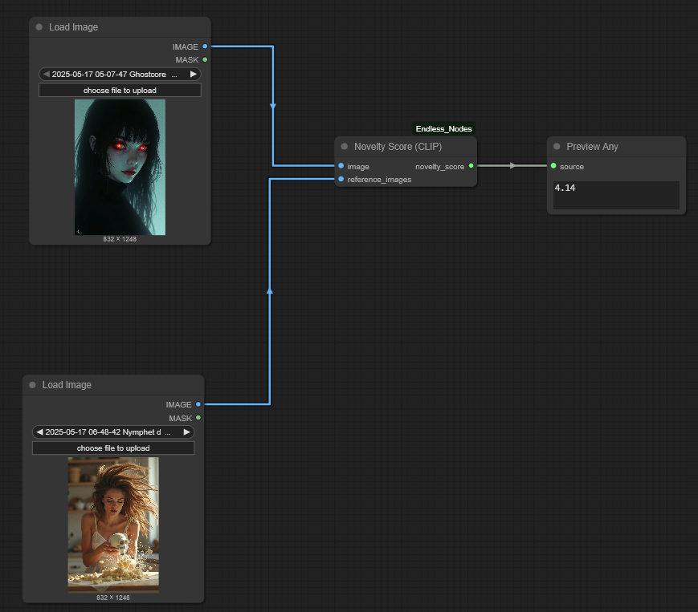

The Novelty Score node matches your image against one or more reference images and computes how different your image is.  The higher the score, the more novel your image is.  The node calculates CLIP embeddings for the input image and compares them to a list of reference embeddings using cosine similarity.  You can compare it to one other image, but it's more fun to compare to a range of them.

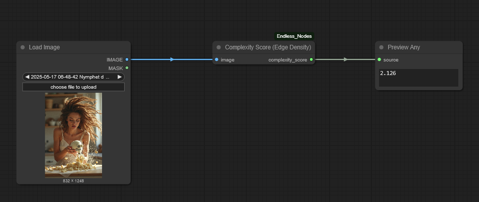

Similarly, the Complexity Score node indicates how complex an image is, with more complex images scoring higher.  This is based on edge detection and other variances found in the image.  The node converts the image to grayscale, applies `FIND_EDGES` from `PIL`, and calculates what percent of pixels are above a threshold.


### Randomizer Nodes

There are two sets of nodes, for text selection and to randomize parameters.

**Text Randomizers**

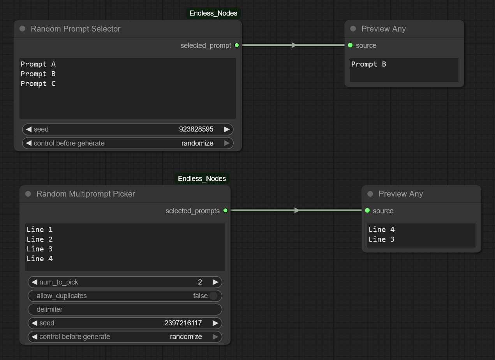

These nodes will randomly select text from the input. There are two nodes, one that picks one line from the list, and one that selects *x* number of lines from the list.  Useful for randomly picking prompts.

**Parameter Randomizers**

There are three nodes: Endless Mayhem, Endless Chaos, and Endless Pandemonium.  Each of the first two allow you to randomly select parameters such as steps, CFG value (CFG Guidance for Flux is available as well), height, width, and the seed, with minimum and maximum values. 

All nodes have a Boolean flag to set the dimensions to be divisible by 64; if left off, the dimensions will be divisible by 16.  The Mayhem and Chaos nodes have sanity checks so if one value in a pair you put in is lower than its counterpart, they are automatically flipped. For example if you put in "10" for the minimum steps and put in "3" for the maximum instead of the "30" you probably wanted, the node will make "3" the minimum and "10" the maximum. 

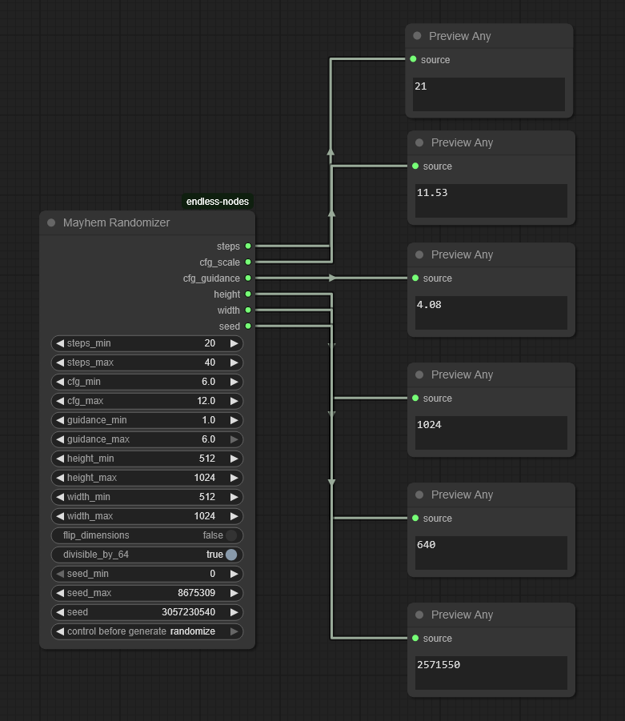

The Mayhem node will optionally randomly flip the height and width values on you, so the image moves from portrait to landscape. Why? Why not? Actually it's based on something I jimmy rigged into a Google Colab notebook back at the dawn of widely available code for AI art ... late 2021!

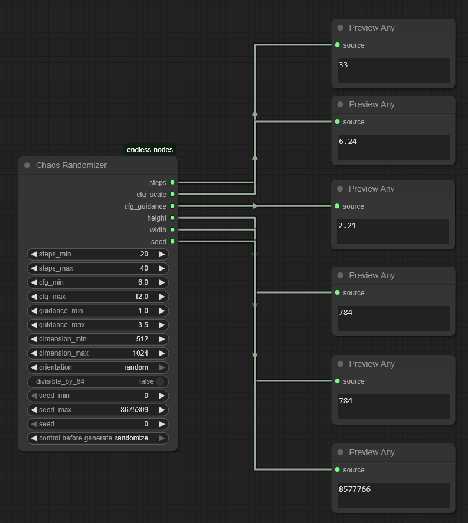

The Chaos node allows you to select an orientation: square, portrait, landscape, or random. Selecting square will give you random dimensions between the minimum and maximums you set but keeps the aspect ratio at 1:1. Otherwise, the node will attempt to give you a random aspect ratio from the list below and will use either portrait, landscape, or randomly select an orientation. If it fails to find a suitable aspect ratio, it reverts to square.

Potential aspect ratios, with the inverse ratios also available:

+ 5:4
+ 4:3 Classic
+ 7:5
+ 3:2 Classic photo
+ 8:5
+ 5:3
+ 16:9 Widescreen
+ 1.85:1 Cinema
+ 1.92:1 Instagram Stories
+ 2.2:1 70mm Cinema
+ 21:9 Ultrawide (2.33:1)
+ 2.39:1 Anamorphic
+ 2.8:1 Facebook Cover (approx.)

See below for a set of images that are identical in parameters except for a randomly applied aspect ratio:

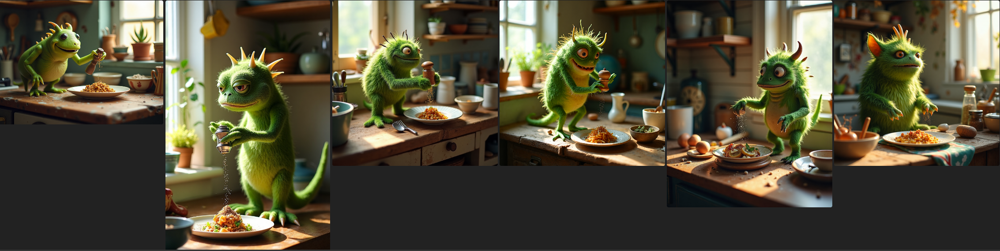


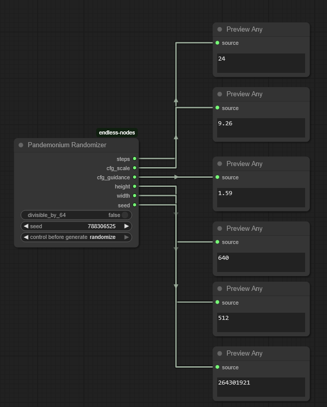

The Pandemonium node is a black box. It's very similar to the Chaos node, but you have no input into the minimum and maximum values.  Is it silly?  Sure.  Does it make your image creation more random?  Absolutely. 


### Text Input Switch

Allows the user to select between four, six, and eight text inputs and uses a selector at top to make the selection. Useful for multiple inputs for prompt creation. 
Note: you need a minimum of one input, the rest are optional.

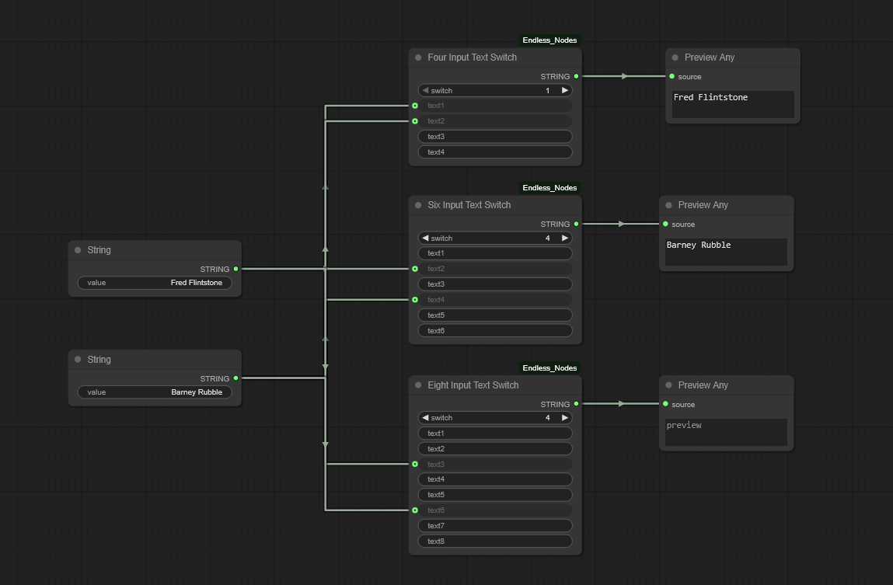

### Integer Input Switch 

As above, but for integers.  There is also an Integer Input Switch Widget (not shown)

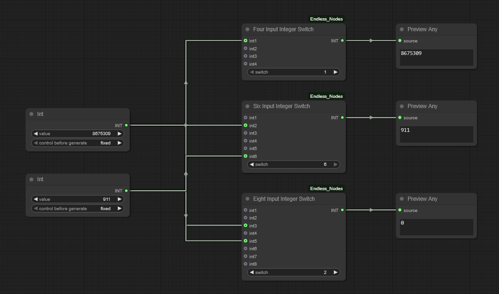

### Nodes that don’t work (yet!)

I do have some nodes that are half-way done, but not ready for prime time.  They’ll be uploaded when I get to them.

+ Image Aesthetic Scoring (Aesthetic values, NIMA, and BRISQUE methods)
+ Batch image loader
+ Multiple input/output converter
+ Additional image analysis nodes 
***
## Usage License and Restrictions

See [GPL Licensing V3](https://www.gnu.org/licenses/gpl-3.0.en.html#license-text) for usage. You may modify this code as long as you keep the credits for this repository and for those noted in the credit section below. **YOU ARE EXPRESSLY FORBIDDEN FROM USING THESE NODES TO CREATE ANY IMAGES OR ARTWORK THAT VIOLATES THE STABLE DIFFUSION [ACCEPTABLE USE POLICY](https://stability.ai/use-policy) OR THE USAGE POLICY FROM [BLACK FOREST LABS](https://bfl.ai/legal/usage-policy).**

For example, don't be a mouth-breather who creates fake nudes or sexual content of **anyone, even if you have their consent**. JUST. DON’T. BE. AN. ASSHOLE.

The author expressly disclaims any liability for any images you create using these nodes.
***
## Disclaimer

These nodes may or may not be maintained. They work on my system but may not on yours. Feel free to send in a bug report if you find one! 
***
## Credits

+ Inspiration for the batch multiprompt node came quite by accident when I used [FizzNodes](https://github.com/FizzleDorf/ComfyUI_FizzNodes) by [@FizzleDorf](https://github.com/FizzleDorf) and wrestled them into creating images instead of the intended use for video
+ Anthropic Claude and OpenAI ChatGPT for coding creation/assistance
+ The image novelty node uses OpenAI's CLIP (ViT-B/32) model to assess image novelty based on cosine distance from reference embeddings
+ Thanks to all the node creators out there, most who toil away with little or no appreciation

#
