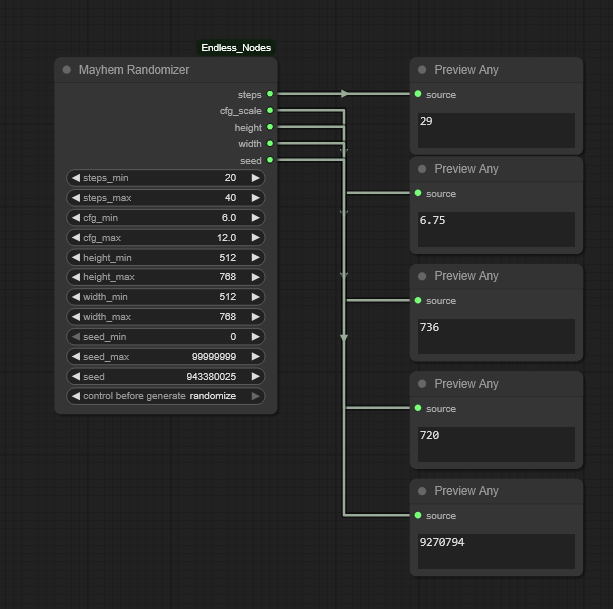

# Endless-Nodes

Some basic custom nodes for the ComfyUI user interface for Stable Diffusion. Features:

+ **True batch multiprompting capability for ComfyUI**
+ An image saver for images and JSON files to base folder, custom folders for one, or custom folders for both. Also allows for Python timestamping
+ Switches for text and numbers
+ Random prompt selectors
+ Image Analysis nodes for novelty and complexity
+ MORE TO COME 

When using the [ComfyUI](https://github.com/comfyanonymous/ComfyUI) interface for AI art generation, I sometimes find that the standard nodes and the many custom nodes out there don't work the way I want them to, or how I think they should.

Rightly or wrongly, I am teaching myself a bit of Python to get some nodes up and running to do what I'd like. Yes, I am using ChatGPT, Copilot, Claude and others, and yes, I am a glutton for punishment. There are no promises that these nodes will work for you or that I will maintain them. Feel free to do with them as you wish, according to the license model.

**UPDATE: JUN 21, 2025**

**Blew everything up and removed all the old nodes.  Nodes with new coding have been uploaded and will be updated semi-frequently until mid-July 2025**

## Installation Instructions

It’s preferable to install from the ComfyUI Node Manager, but for direct installation, do this:

+ Navigate to your /ComfyUI/custom_nodes/ folder 
+ In Windows, you can then right-click to start a command prompt and type:

`git clone https://github.com/tusharbhutt/Endless-Nodes`

If installed correctly, you should see a menu choice in the main ComfyUI menu that look like this: 

Endless 🌊✨

with several submenus for you to select from.

## Assistance Requests

I am not a programmer, nor do I care to be.  I have a fulltime job that eats up 50-60 houts a week and I made these nodes for myself.   I’ve tested the nodes on my system and uploaded them as they see to work. They may or may not work for you or on your system.  

If you have issues, ask me **nicely** for help. Your tone matters; I'm too old and tired to pay attention to people who think I blew up their machines, and I will be as short and presumptuous with you as you are with me. If how I react to you if you are difficult bothers you, some self-reflection is in order on your part.  In simple terms: the world has too many self-important people, so stop adding to the list.

## Node List

### Batch Multiprompt Node for SD, SDXL, and FLUX


See the video!


As far as I know, ComfyUI does not have native capability to allow for different prompts to be run within the *same* batch.  I always found this to be a waste if you have a fast card with a lot of VRAM.  With ComfyUI native, you can set the batch size to, say, create 56 images of the same prompt, or you can change the queue to have multiple runs of different prompts; if you have a fast card, this may not be an issue for you. 

Also, there are some nodes that will create multiple prompts in batches, but the ones I looked at showed they were just doing what is essentially queue management and prompts were still being done only one at a time.  This set of nodes will allow you to create as many prompts as your VRAM can hold and does them simultaneously.  Nodes are available for SDx, SDXL, and Flux. 

Try this out too: pair a node with an endless queue and use wildcards to make an endless random image generator.  


**Nodes available:**
+ SD node for SD1.x and 2.x
+ SDXL node
+ Negative prompt node … yep, make your negative prompts go through simultaneously too
+ Flux node with built-in guidance scale
+ Prompt Counter node can show you the prompts that were run

Inputs:
+ CLIP 
+ Prompts: enter up to 64 prompts at once, the node figures out how many you have.  You can enter prompts directly or via  multiline input node.
+ Print output to console 
+ Maximum batch size (leave at zero to match your line input)

Output:
+ Conditioning: works with standard KSampler
+ Prompt List: For downstream node usage
+ Prompt Count: Counts how many prompts you had

The image below should have a Flux workflow built in, but if not, check out the workflows folder too.  The image is set up for the Flux node, but all you have to do is swap out the Batch Flux node for the other variants in the Endless 🌊✨/BatchProcessing menu. 


## Endless Image Saver


This is why I tried my hand at Python in the first place! There are many good image saver nodes out there, so why one more? Well:

+ The default saver does not save to UNC in Windows, even if you try to put it in the extra paths YAML file
+ Some savers will allow you to save to UNC but have restricted built-in folder formats
+ You can cobble some savers to save an image together with a text file, but the timestamp on the text file tends to be 2-3 seconds off from the image
+ No saver I know of lets you save the JSON file to a **completely different folder**

So… this node will allow you to save your image file wherever you want, with full support for standard [Python date and time conventions](https://strftime.org/) and you can save the JSON file somewhere else.  The feature list includes:

+ Allows multiprompts to be saved as part fo the file name via the prompt_list input
+ Add timestamps in varying formats
+ image format for PNG, JPG, WEBP
+ Custom delimiter
+ Add set number of words from the  positive prompt to the file name
+ Embed JSON metadata
+ Save separate JSON file
+ Filename number padding at start or end (placed *after* timestamp if timestamp is enabled)
+ Filename prefix
 + OS independent, UNC enabled custom JSON and Output folders, which can be separate from one another
+ Negative prompt list (**meh**, not sure if it really works yet)

Does it work...? You betcha!


JSONs to the left of me, images to the right of me, and here I am stuck in the middle with you! It works!

*A note on timestamp formats*

This module uses the standard Python date and time stamp formats, it **_does not_** use the date and time format popular in the WAS Suite. See below for equivalency examples:

 - WAS Suite would use: ```[time(%Y-%m-%d__%I-%M%p)]```
 - Python standard is: ```%Y_%m_%d__%I-%M%p``` 

### Image Analysis Nodes

You can use these two node to see how novel or complex your images are.  The Novelty Score node match your image against one or more reference images and computes how different your image is.  The higher the score, the more novel your image is.


Similarly, the Complexity Score node indicate how complex an image is, with more complex images scoring higher.  This is based on edge detection and other variances found in the image.


### Randomizer Nodes

There are two sets of nodes, for text selection and to randomize parameters.

**Text Randomizers**

These nodes will randomly select text from the input. There are two nodes, one that picks one line from the list, and one that selects *x* lines from the list.  Useful for randomly picking prompts.


**Parameter Randomizers**

There are two nodes: Endless Mayhem and Endless Chaos.  Both allow you to randomly select parameters such as steps, CFG value, height, width, and the seed.  The Chaos node will also randomly flip the height and width values on you, so the image moves from portrait to landscape, for example.



### Text Input Switch

Allows the user to select between four, six, and eight text inputs and uses a selector at top to make the selection. Useful for multiple inputs for prompt creation. 
Note: you need a minimum of one input, the rest are optional.


### Integer Input Switch 

As above, but for integers.  There is also an Integer Input Switch Widget (not shown)


### Nodes that don’t work (yet!)
I do have some nodes that are half-way done, but not ready for prime time.  They’ll be uploaded when I get to them.

+ Image Aesthetic Scoring (Aesthetic values, NIMA, and BRISQUE methods)
+ Batch image loader
+ Multiple input/output converter
+ Additional image analysis nodes 

## Usage License and Restrictions

See GPL Licensing V3 for usage. You may modify this code as long as you keep the credits for this repository and for those noted in the credit section below. **YOU ARE EXPRESSLY FORBIDDEN FROM USING THESE NODES TO CREATE ANY IMAGES OR ARTWORK THAT VIOLATES THE STABLE DIFFUSION [ACCEPTABLE US POLICY] (https://stability.ai/use-policy) OR THE USAGE POLICY FROM [BLACK FOREST LABS]( https://bfl.ai/legal/usage-policy).**

For example, don't be a mouth-breather who creates fake nudes or sexual content of **anyone, even if you have their consent**. JUST. DON’T. BE. AN. ASSHOLE.

The author expressly disclaims any liability for any images you create using these nodes.

## Disclaimer

These nodes may or may not be maintained. They work on my system but may not on yours. Feel free to send in a bug report if you find one! 

## Credits

+ Anthropic Claude and ChatGPT for coding creation/assistance
+ Thanks to all the node creators out there, most who toil away with little or no appreciation

#
